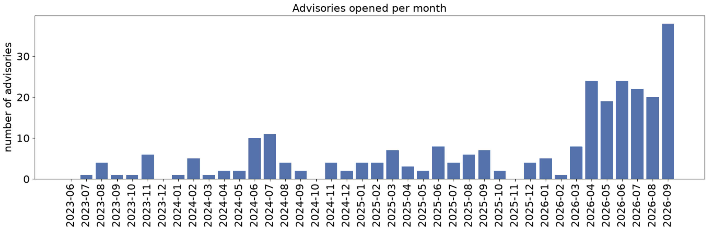
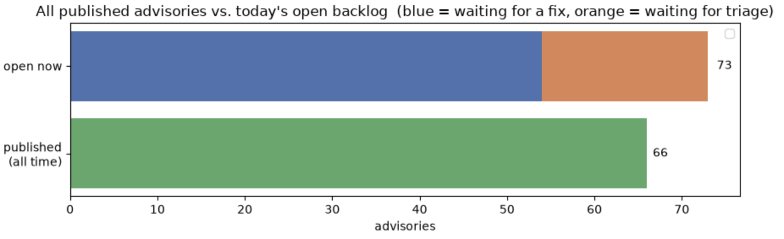
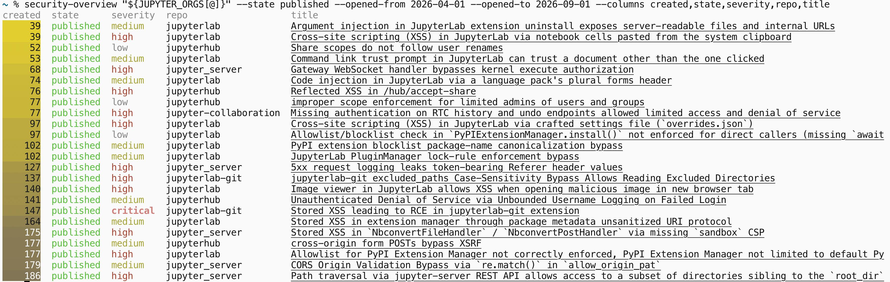

# Jupyter Security

## Coordinating security across 350+ repositories

Yann Pellegrini

https://github.com/Yann-P/oss-prague-2026-jupyter-security

---

# About me

## Yann Pellegrini

Jupyter Security triage and coordination since April 2026, funded 1 day/week

Software Steering Coucil member for security

PyData Sphinx Theme maintainer

Background: MSc software engineering, 8 years fullstack developer

---

# Disclaimer

- Jupyter Security is not a solved problem
- This talk is here to encourage discussions

---

# Security is a subproject of Jupyter

### The Jupyter Security Council

✏️ security-council@jupyter.org
🏠 https://github.com/jupyter/security

---

# What makes Jupyter stand out in the open source security landscape

- 22 GitHub organizations, 423 repositories, 203 PyPI packages
- Executes code by design, where is the security boundary?
- Different security practices across repos

---

# State of security in Jupyter

##  Increase in reports volume

Source: https://github.com/jupyter/security/blob/main/lab/advisories.ipynb

---

# State of security: Reports piling up

Source: https://github.com/jupyter/security/blob/main/lab/advisories.ipynb

---

# State of security: what's been done since April: triage

* Lower the triage backlog from ~120 to ~20
* Triage 20/month

---

# State of security: what's been done since April: long-term initiatives

- supply chain security
- inventories
- repository attribution
- document security good practices and processes

---

# State of security: what's been done since April: tooling

`github-security-overview`

https://github.com/Yann-P/github-security-overview

---

# AI

---

# Is AI any good at finding vulnerabilities? The good

* Finds large chains of defects leading to an exploit (e.g. `wp2shell`)
* Is thorough after enough runs

---

# Is AI any good at finding vulnerabilities? The bad

* Lots of false positives or benign findings
* Proof-of-concepts are difficult to reproduce if they even work
* Reports not readable by humans: 300 lines of text with too much fine-grain technical details
* Speaking to bots
* No downsides to submitting slop reports, so we get flooded 
    * Example : up to 10 reports by the same person 
    * ON THE SAME REPO, **ON THE SAME DAY**

---

# AI as a tool for report triage?

### Fully manual triage = 🦕🪨🪓

* Just copy/pasting the report does not work very well.
* AI leans towards confirming too-large and over-detailed reports.
* Documenting security boundaries has a **compounding effect**.

--- 

# AI as a tool for fixing vulnerabilities?

- Same issues as general AI open source contributions

--- 

# AI: a shift in report disclosure

- Some vulnerabilities are trivial to find
- Sometimes, fixing fast is better than withholding reports

--- 

# What other open-source maintainer say

This last month we had 22 unique security advisories. Our project has been built with adherence to the OWASP Top Ten Guidelines [...] from the beginning. 

But software is hard and AI is thorough.

Each month, we fix them all in our monthly maintenance release and disclose at that time.

We fight AI fire with fire, and hand-review, of course.

Tom Boutell, apostrophecms https://news.ycombinator.com/item?id=49932830

---

# What other open-source maintainer say

To make a good vulnerability report, you should make sure you understand what the software is supposed to do – and what the documentation says its limitations and conditions are. 

A good Open Source project has those things documented.

Daniel Steinberg, curl https://daniel.haxx.se/blog/author/daniel/page/2/

---

# Back to Jupyter 🪐

---

# Next steps for Jupyter Security

* Keep the triage backlog low
* Tooling, tooling, tooling (manual just does not scale)
* Documentation
  - processes, to share knowledge and allow contributions
  - security model in repositories, to help steer AI
* Communicate
  - reach out to potential security contributors
  - with maintainers

---

# Jupyter Security is more open than you think!

- **Read or open issues in https://github.com/jupyter/security**
- Chat on https://jupyter.zulipchat.com `@Security[Public]`
- Join our Tuesday [community meetings](https://docs.jupyter.org/en/stable/community/content-community.html)
- Reports published every month: https://jupyter-governance.github.io/funding-proposals/projects/2026/security/

---

# Acknowledgements

- Jupyter Foundation for 2 rounds of security funding
- M Bussonnier, Mike Krassowski, Jason Grout, Min Ragan-Kelley for taking time to get me started on Jupyter, and PRs reviews.

Jupyter is a very welcoming community!

---

# Thanks :pray:

### Survey

https://framaforms.org/jupyter-security-poll-1791265952

### Slides

http://github.com/Yann-P/oss-prague-2026-jupyter-security

